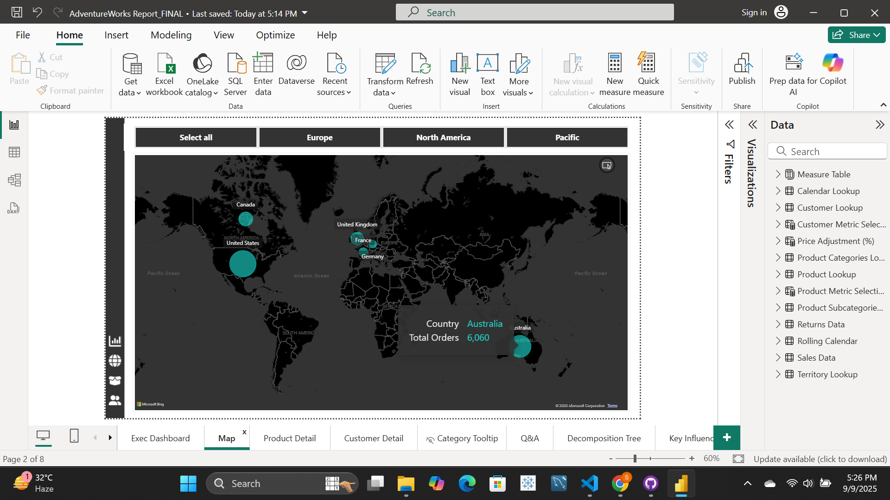
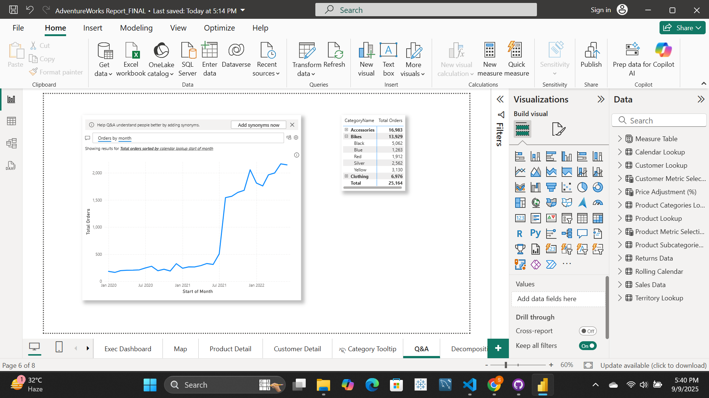
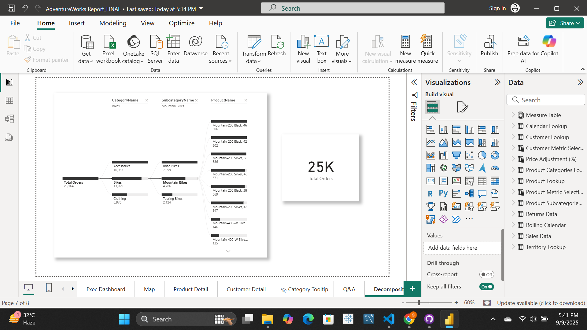

🚀 AdventureWorks Sales Analytics Dashboard

This repository contains an interactive Power BI Dashboard built on the AdventureWorks dataset. 
The project focuses on providing business insights into sales, customers, products, and geographies through visually rich reports.
-----------------------------------------------------------------------------------------------------------------------------------------------------------------------------
📊 Project Overview

The dashboard helps stakeholders answer key business questions such as:
        💰 Revenue & Profit Trends – How are sales and profits trending over time?
        🛍️ Product Insights – Which products and categories drive the most sales?
        🌍 Geographical Insights – Which countries/regions contribute most to orders?
        👥 Customer Analysis – Who are the top customers, and what are their purchasing behaviors?
        ❓ Ad-hoc Analysis – Quick Q&A for dynamic business queries.
-----------------------------------------------------------------------------------------------------------------------------------------------------------------------------
🖼️ Dashboard Pages

1️⃣ Executive Dashboard
        Key KPIs: Revenue, Profit, Orders, Return Rate
        Revenue trend line with forecast
        Top products & categories
        Monthly revenue, orders, and returns
        

2️⃣ Map View
        Geographic distribution of total orders
        Interactive filters by region (Europe, North America, Pacific)
        

3️⃣ Product Detail
        Product-specific performance (orders, revenue, profit, returns)
        Monthly trends vs. targets
        Adjustable profit scenario (Price Adjustment %)
        

4️⃣ Customer Detail
        Unique customers & revenue per customer
        Segmentation by Income Level and Occupation
        Top 100 customers table with revenue
        Highlight on Top Customer of the Year
        

5️⃣ Q&A (Natural Language Query)
        Ask business questions in plain English
        Example: “Orders by month”
        Instant visual response
        

6️⃣ Decomposition Tree
        Drill-down view of orders by category → subcategory → product
        Interactive exploration for root-cause analysis
        
-----------------------------------------------------------------------------------------------------------------------------------------------------------------------------
🛠️ Tools & Technologies

Power BI Desktop – Report building & visualization
AdventureWorks Dataset – Sample data for analysis
DAX (Data Analysis Expressions) – Custom measures & KPIs
Power Query (M Language) – Data transformation & cleaning
-----------------------------------------------------------------------------------------------------------------------------------------------------------------------------
